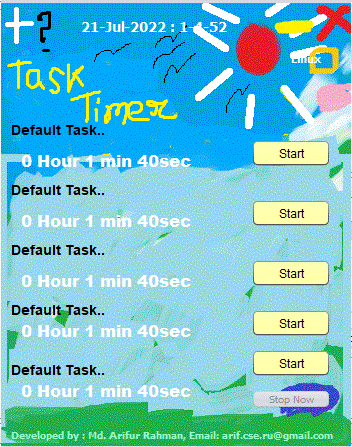
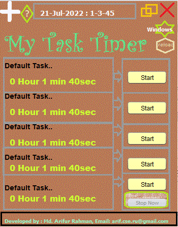

# Productivity Task Timer

This is desktop task timer

1. Download the jar file and db file
2. Install java on your pc (jdk 1.8 recommended)

3. Double Click 'TaskTimer.jar'

Image (Hand draw theme)

Image (Standard theme)

#Release Note

1. 20-July-2022 :  Initial project for version 1 and 2 introduced
2. 23-July-2022 :  Following fixing done ->
    * During small window if any task finished then automatically opened big window and makes duplicate.
        In this case duplicate window should not be opened.
    * Small and tiny window cannot be stopped. it opens immediate bigger window.
       If close button is there then click event should close and stop the app
    * Windows themes Task Timer logo crosses task list data
    * Reload button is not working
    * During restore window running tasks button was not disabled which should be.
    * Stop Now button is not disabled/enabled properly

#Fixing 29-July-2022
	* 2 seconds decrementing in task timer instead of 1 second decrementing
	* In tiny timer seconds counter is invisible , it should be visible
	* In mini timer screen start-stop button should work properly 
	* In tiny timer task counter label font color should be black